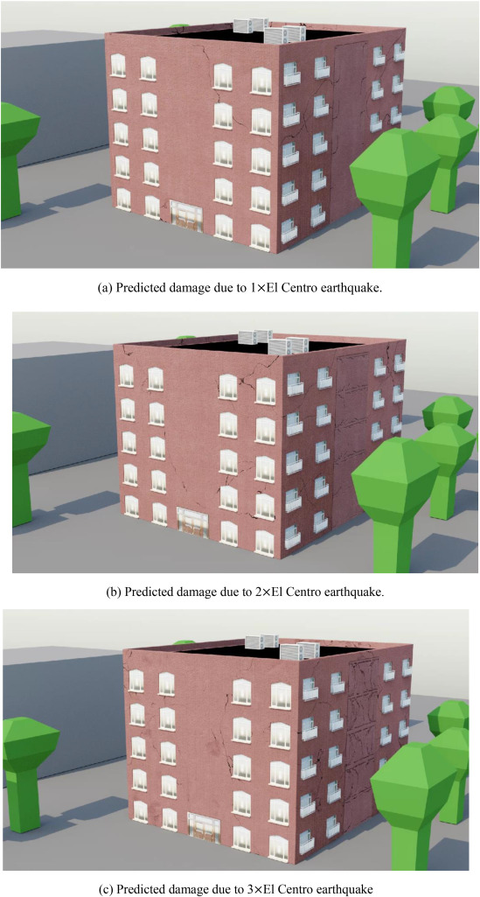

# A graphics-based digital twin framework for computer vision-based post-earthquake structural inspection and evaluation using unmanned aerial vehicles

This GitHub repository is my code contribution to the paper: A graphics-based digital twin framework for computer vision-based post-earthquake structural inspection and evaluation using unmanned aerial vehicles. 

The paper can be found here: 
https://www.sciencedirect.com/science/article/pii/S2772991522000032

If you use any part of this code, ideas, or figures below, please be sure to cite this paper!!
 
My main contribution for this paper was the physics-based damage and heuristics-based damage creation for the 5 story building and the methodologies of how to turn the finite element model (FEM) damage hotspots and structural analysis results into damaged textures and damaged graphics models. Shuo Wang and Guanghao Zhai created and ran the FEM and global structural analysis respectively for this paper. Both of the results from these models and run were used as inputs to my work. I also created a method to turn an image of an as-built structure's material into undamaged textures that can be applied to a digital twin.

I was the sole developer of several python scripts and their associated methodologies for damage creation and modeling for this paper including:

* Create textures for an undamaged random material with a similar likeness to an inputted image of a material (undamaged_textures.py and undamaged_textures_ex.ipynb)
* Create textures for a damaged material based on FEM hotspots (physics_damage_textures.py and physics_damage_textures_ex.ipynb)
* Blender script to automatically create a damaged material using the damaged textures (blender_structDamageMat.py)
* Heuristics Damage Method to automatically create a non-structural material in Blender given a story drift ratio or acceleration (blender_nonstructDamageMat.py)

Very detailed descriptions of what each script does and how it works can be found in the following sections. For references for this README, please see the paper and its references.

Note: None of the data or results are given due to security reasons.

If you would like a copy of the paper, please feel free to email me at: caseyjr2@illinois.edu

## Create textures for an undamaged random material with a similar likeness to an inputted image of a material

The .ipynb file is used as an example to show how to use the .py file. The main input to this script is a close up image of the material you want the undamaged material of. For this paper, the inputted image is a close up image of concrete on the "as-built" structure. There are also options for inputting the desired width and height of the output texture images. The main output to this script is a set of textures that represent an undamaged material. The set of textures include an RGB map, a normal map, a displacement map, and a roughness map. These textures are combined in Blender to create an undamaged material.

The figure below shows the general steps of the methodology.

First, a reference concrete image is obtained during the photographic survey of the “as-built” structure, which is simulated in Blender. Note that the image should be acquired facing directly toward the target wall at a distance that will ensure the quality of the obtained image. Subsequently, random patches are taken from the reference concrete image and then stitched together using an Image Quilting method proposed by Efros and Freeman (2001). This produces a random concrete image with similar characteristics and aesthetics to the reference concrete image, but of a larger size. Because in Blender, textures are repeated if they are smaller than the area to which they are applied, the obtained concrete image is further processed using the Poisson Image Editing approach proposed by Pérez et al. (2003). The resulting seamless image are then used as the base color map for the undamaged concrete texture in the CG model.

Other texture maps for the undamaged concrete texture, such as of normal, roughness, and displacement, are generated from this base color map. The method of generating other texture maps used herein assumes that changes in intensity values of the base color map are due to surface textures rather than changes in color. The normal map is created by utilizing the grayscale image of the base color map as a height map. For each pixel, a simplified version of the cross product of the height differences in two directions is defined to generate the surface normal vector, which will then be normalized to be unit length. The roughness map is obtained by multiplying the grayscale image of the base color map with a constant greater than one, as the concrete surface tends to be very rough. The displacement map is obtained by applying a slight blur to the grayscale version of the base color map. The extent of roughness and displacement is chosen by trial and error, with the aim of making the obtained undamaged concrete texture represent the “as-built” structure accurately.

The four outputted texture maps can be used as inputs to the Principled BSDF Shader Node of Blender to texture 3D components.

## Create textures for a damaged material based on FEM hotspots

The .ipynb file is used as an example to show how to use the .py file. The main inputs to this script are a damage hotspot map and material images of concrete, longitudinal rebar, and stirrup rebar. The rebar images must have a transparent background and must be consistent with their direction (i.e. the longitudinal rebar must be vertical and the stirrup rebar must be horizontal for a wall). There are also options for inputting the actual width of the concrete area, if there is rebar in the material, if you want the damage to be all spalling or spalling and cracks, and how much you want the output images to be scaled compared to the damage hotspot map. These textures are combined in Blender to create a damaged material.

The figure below shows an example of a damage hotspot map that one of my co-authors, Guanghao Zhai, made for the paper.

The main output to this script is a set of textures that represent a damaged material. The set of textures include an RGB map, a normal map, a displacement map, and a roughness map.

The first step in the structural damage representation process is to sort the damage hotspots by damage type and then generate damage masks from the corresponding damage-index maps. The damage masks represent the location of each type of damage, which are cracking and spalling in this example. To extract the damage hotspots, i.e., the red regions, the damage-index map is converted to the HSV (hue-saturation-value) color space. Then, the corresponding regions within the red range of hues are extracted to create a binary mask as shown in (b) of the below figure, representing both types of damage. The grid lines indicating the element boundaries are removed using a morphological transformation in OpenCV (Doxygen, 2022), resulting in (c). Next, the contours of the binary mask are obtained using the findContours function in OpenCV (Rosebrock, 2018), allowing differentiation of the two types of damage based on features of their shape -- cracking tends to be long and thin, having a small area-to-perimeter ratio, while spalling tends to have a fuller shape, having a larger area-to-perimeter ratio. This area-to-perimeter ratio threshold that is used to differentiate the two types of damage is manually fine-tuned to separate them effectively. The resulting initial crack mask and the initial spalling mask are shown in (d) and (e). Often, the spalling region may also contain cracks, which can lead to the regions of cracking being mislabelled. Therefore, the initial spalling mask is contracted and subsequently dilated, removing the misclassified cracks, producing the final spalling mask in (g). This final spalling mask is then differenced with the initial spalling mask and complemented with the initial crack mask to yield the final crack mask shown in (f). Moreover, if the spalling is severe, rebar may also be exposed; the mask for the exposed rebar will be somewhat smaller than the associated spalling region, as shown in (h). These damage masks represent the location of each type of damage and will be used later for the generation of texture maps.

Next, the textures for the various regions of the damaged structural component need to be created; for the shear wall in the paper, these regions are: (i) undamaged concrete, (ii) cracked concrete, (iii) spalled concrete, and (iv) exposed rebar. The textures for each region are comprised of base color, normal, bump, and displacement maps, which are then integrated through damage masks and used as input to the Principled BSDF and the Displacement Modifier in Blender. The generation of each of these maps is described below.

The base color map represents the diffuse surface color and is first created for each region, which is then combined into one complete map for the entire component. The base color map for the undamaged and spalled concrete regions, as well as the exposed rebar regions, can be obtained from field images of corresponding concrete members. The base color map for the cracked concrete regions is obtained as follows. First, the color of the crack mask in (g) of the figure above is reversed so that cracking regions appear in black. Then, the cracking regions are dilated to eliminate discontinuities, and the Zhang-Suen thinning algorithm function in OpenCV (Zhang et al., 1984) is applied to create more physically consistent images of the cracking. Finally, making use of the mask of each region, the obtained base color maps for different regions are combined into one complete base color map for the entire structural component, as shown in the below figure.

The normal map implies the surface normal directions at every point and plays a significant role in accurate renderings (Hoskere et al., 2022). The procedure of generating the normal map is as follows. First, the RGB base color map in the figure above is converted to a grayscale image and treated as a height map, and an outer normal unit vector to the corresponding surface is calculated. The (x, y, z) coordinates of this normal vector are represented as intensities of the RGB channels for each pixel. The figure below (a) shows the resulting normal map.

Bump and displacement maps represent variations in the height of the surfaces; however, bump maps are used for smaller surface deformations, while displacement maps are used for larger irregularities. The bump map for the spalling regions is created using the Perlin noise textures (Anaconda, 2022). The bump map for the exposed rebar regions is generated by increasing the contrast on the grayscale representation of the corresponding base color map. The bump map for the exposed rebar regions is then merged with that for the spalling regions to create the final bump map as shown in the figure above (b). The crack depth is represented through the displacement map for the cracking regions, as shown in the figure below (a), which is obtained assuming that the thinned crack mask corresponds to voids and that a gradual transition exists between the center and the edges of the crack. The displacement map for the spalling regions shown in the figure below (b) represents the corresponding geometric surface variation, which is obtained by scaling the exposed rebar bump map and then merging it with the spalling mask.

## Blender script to automatically create a damaged material using the damaged textures 

This script automatically creates a damaged Blender material using the damaged textures from the previous methodology and script. It utilizes Blender Python API so all the user has to do is run the script and apply the generated material to the desired mesh. Theoretically, this script could work for any material that just has a RGB map, normal map, displacement map, and roughness map. It can be generally applied, but was used to create the damaged material for this paper.

First, these texture maps are imported to Blender. First, the bump map is employed to perturb the previously defined normal map via the Bump Node (Blender 3.1 Manual, 2022e). Then, the base color map and the disturbed normal map are input to the Principled BSDF, and the displacement map is input to the Displacement Modifier to deform the mesh. The final representation for this damaged structural component is shown in the figure below (a), which looks photorealistic compared to a real shear wall damaged in the 2011 Van earthquake (EERI, 2011), as shown in the figure below (b).

## Heuristics Damage Method to automatically create a non-structural material in Blender given an interstory drift or acceleration

The “heuristics-based” in the name of HBDM highlights the dependence on relevant specifications and the introduction of randomness, rather than on detailed FE analysis, in contrast to the PBDM for structural components. The HBDM procedure is summarized in the below figure. First, fragility curves, which express the probability of reaching or exceeding a specific damage state, are created for the nonstructural components following relevant specifications (e.g., Seismic Performance Assessment of Buildings (FEMA P-58-2, 2018)). Next, damage parameters from the global FE analysis are used as input to the fragility curves to obtain the expected damage states of the nonstructural components. Random damage of the nonstructural components is generated consistent with the expected damage states and applied via the principled BSDF in Blender using appropriate noise textures and Color Ramp (Blender 3.1 Manual, 2022c, d).

This script automatically creates a damaged Blender material using the heuristics damage methodology as outlined below. 

It utilizes Blender Python API so all the user has to do is run the script and apply the generated material to the desired mesh. The main inputs are: a folder address to the folder with the undamaged textures, a damage parameter like story drift ratio and peak floor acceleration, and some miscellaneous information depending on the element. For this paper, precast concrete cladding was used to demonstrate the method. In this case, story drift ratio, peak floor acceleration, connection height (top of wall height), and structure height above grade were needed.

First, fragility curves, which express the probability of reaching or exceeding a specific damage state, are created for the nonstructural component. In this case, the precast concrete cladding panel belongs to Component Category B2011.201a - B2011.201b of FEMA P-58-2. Two different fragility curves are associated with this component corresponding to two damage cases: in-plane damage and out-of-plane damage. In-plane damage is controlled by story drift ratio, while out-of-plane damage is controlled by peak ground acceleration. The fragility curves used herein are cumulative lognormal distribution functions, which are specified by the median and dispersion that are determined by the connection type and strength. According to the provisions in FEMA P-58-2 and the properties of the example concrete cladding panel, the fragility curves for the in-plane and out-of-plane damage cases are derived as shown in the below figure. Subsequently, the story drift ratio and peak ground acceleration, which are obtained from the global FE analysis of the structure to which this concrete cladding panel belongs, are used as input damage parameters to find the probability of failure of this nonstructural component. The higher probability of failure from the in-plane and out-of-plane cases is then used to determine the damage state of the component, thus indicating the amount of damage.

Next, the photorealistic representation of nonstructural component damage is realized in accordance with the expected amount while preserving some randomness. Voronoi (Blender 3.1 Manual, 2022f) and noise textures are combined to create the nonstructural cracks and spalling, while a Color Ramp is used to control the size of the damage (Youtube Ducky 3D, 2020. Youtube Blender Made Easy, 2020). The amount of damage is reflected by linearly interpolating between the worst-case damage state and the undamaged state on the Color Ramp. The values for these two states on the Color Ramp are picked by trial and error. This photorealistic damage realization method is based on the Principled BSDF in Blender and is carried out automatically via Blender-Python API. The figure below (a) shows the final representation for the damaged concrete cladding panel in Blender, which looks photorealistic if compared to a real panel damaged in 2017 Jiuzhaigou earthquake (Dai et al., 2018), as shown in the figure below(b).

## Final Results

The final results of the paper were a graphics-based digital twin of an "as-built" structure ran with three different amplitudes of the El Centro earthquake. An increasing number of cracks are shown as the earthquake amplitude increases as shown in the figure below. I applied the undamaged and damaged materials to the as-built structure and digital twin and did some minor mesh clean up.

## Paper Contributions

Shuo Wang lead the project and made the as-built building's structural and non-structural meshes along with texturing the windows and balconies. She also designed the structure of the building and ran a global structural analysis for the building via SAP2000. Shuo also was the primary author for the Introduction along with the corresponding literature review for it.

Guanghao Zhai created and ran the Abaqus model for the building. He developed a method to determine which areas of the FEM results are damage hotspots.

I created a method to turn the FEM damage hotspots into damaged textures and materials using OpenCV and Python. I also created the methodology behind the heuristics-based damage to turn global structural analysis results into damaged textures and materials using FEMA P-58 and Python API for Blender. Additionally, I created a method to turn an image of an as-built structure's material into undamaged textures that can be applied to a digital twin. Also, I applied the undamaged and damaged materials to the as-built structure and digital twin and did some minor mesh clean up.

Thomas Ngare Matiki and Brian Welsh developed a procedure for planning and assessing the various UAV inspection trajectories using the GBDT. This included taking into account various real life factors for UAV including no-fly zones, battery life, camera resolution, camera angle, etc. They conducted UAV surveys and generated point clouds with RealityCapture. These point clouds were then evaluated using CloudCompare.

Amirali Najafi was a close supervisor of the project. Yasutaka Narazaki and Vedhus Hoskere were lab alumni who are experts in similar topics. Billie Spencer and Jingjing Wang were supervising professors.